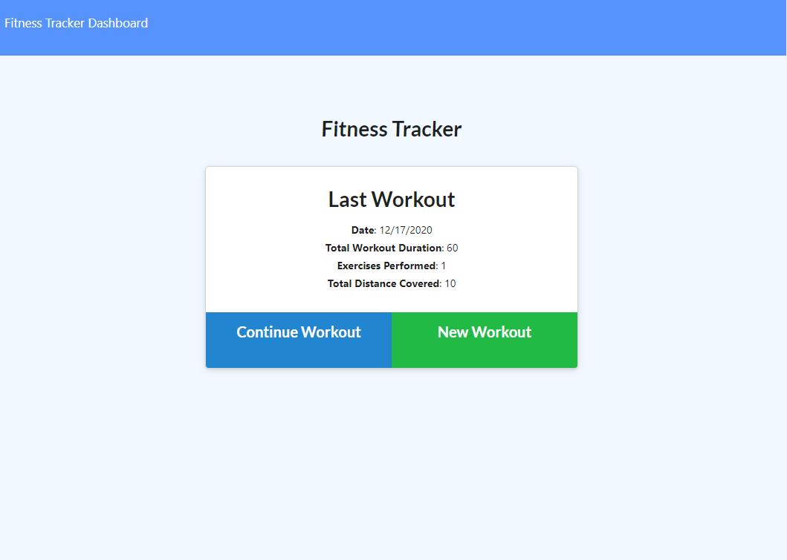
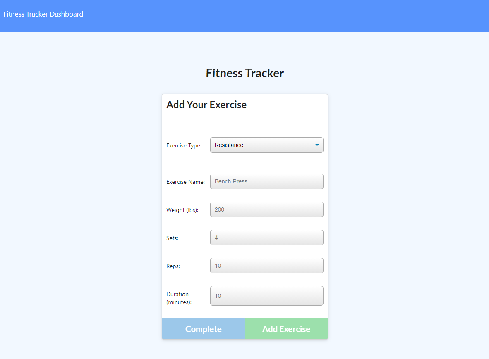
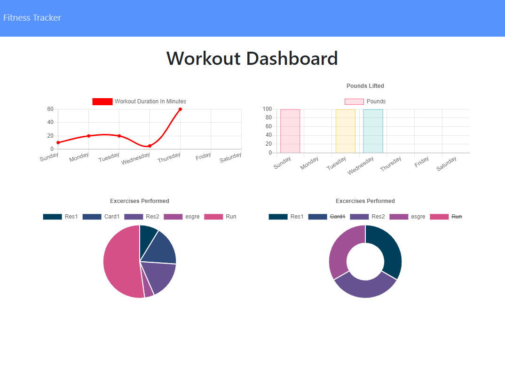

# Fitness Tracker

## Description

As a user, I want to be able to view create and track daily workouts. I want to be able to log multiple exercises in a workout on a given day. I should also be able to track the name, type, weight, sets, reps, and duration of exercise. If the exercise is a cardio exercise, I should be able to track my distance traveled. I was provided with the front-end code, and had to create the Mongo database with Mongoose schema and Express routes

## Table of Contents

- [Fitness Tracker](#fitness-tracker)
  - [Description](#description)
  - [Table of Contents](#table-of-contents)
  - [Installation](#installation)
  - [Usage](#usage)
  - [License](#license)
  - [Contributing](#contributing)
      - [Contributor Covenant Code of Conduct](#contributor-covenant-code-of-conduct)
  - [Tests](#tests)
  - [Questions](#questions)

## Installation

Install NPM Packages via `$ npm i`

## Usage
### **Technologies**

- MongoDB
- Heroku
- .env Environment Variabls
- HTML/CSS
- Javascript
- Compression NPM Package

When the user loads the page, they are given the option to create a new workout or continue with their last workout.
The user is able to:

- Add exercises to a previous workout plan.

- Add new exercises to a new workout plan.

- View the combined weight of multiple exercises on the `stats` page.

## License

Licensed under the [MIT](https://github.com/markdcross/fitness-tracker/blob/master/LICENSE.txt) license.

## Contributing

#### [Contributor Covenant Code of Conduct](https://www.contributor-covenant.org/version/2/0/code_of_conduct/)

## Tests

## Questions

Feel free to contact me with any questions or feedback:

- GitHub: [markdcross](https://github.com/markdcross)
- Email: <markdcross@gmail.com>
